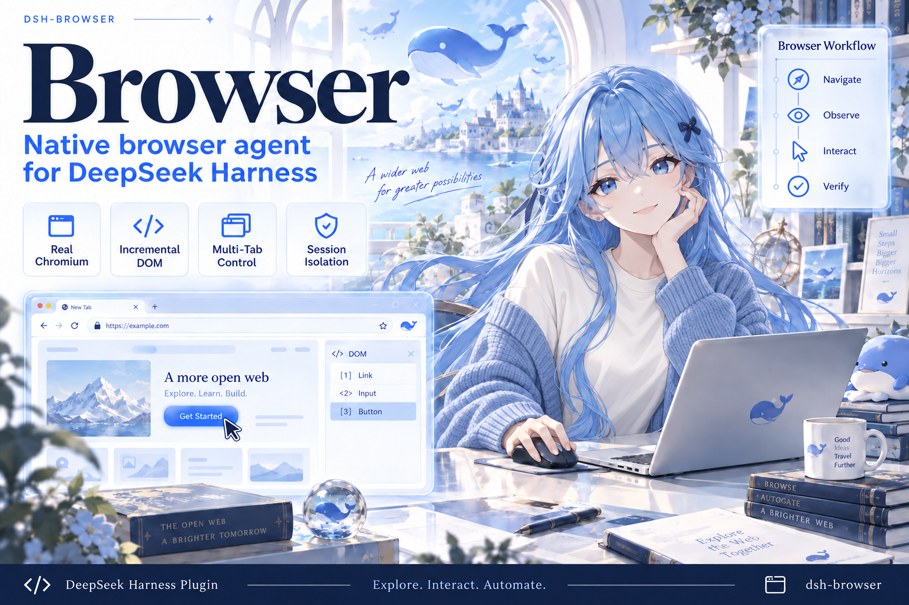

<h1 align="center">dsh-browser-plugin</h1>

<p align="center">Native Chromium browser Agent tools for DeepSeek Harness</p>

<p align="center">
  <a href="LICENSE"></a>
  = 22.19">
  
  
</p>

<p align="center"><strong><a href="#中文">中文</a> | <a href="#english">English</a></strong></p>

---

<a id="中文"></a>

# 🇨🇳 dsh-browser-plugin（中文）

> 给 DeepSeek Harness 装上真实浏览器：让 Agent 能够打开网页、理解页面、填写表单、管理标签页并完成多步骤任务。

`dsh-browser-plugin` 是一个可独立安装的 [DeepSeek Harness（DSH）](https://github.com/deepseek-ai/deepseek-harness) Web profile 插件。它直接启动本机 Chrome 或 Chromium，通过 Puppeteer、Chrome DevTools Protocol（CDP）和增量 DOM 快照向 Agent 提供 15 个浏览器操作，并配有 2 个任务记忆工具。

本仓库只包含浏览器插件自身的源码，不包含 DeepSeek Harness 源码，也不要求用户克隆 Harness 仓库。

本版本通过 DSH 的原生扩展点，把浏览器运行时与上下文策略接入 Agent Harness。这里的 Host 是 DSH 的 Agent/Session 运行时；插件仍可独立打包安装，不需要复制或修改 DSH 源码。

## 它能做什么

| 任务 | 没装插件 | 装上插件 |
|---|---|---|
| 访问动态网站 | 只能依赖搜索或静态抓取 | 启动真实 Chromium 并操作页面 |
| 填写复杂表单 | 无法处理弹窗、下拉框和动态字段 | 通过 DOM 引用定位、输入和点击 |
| 多步资料调研 | 每一步都要人工复制页面内容 | Agent 可在多个标签页之间持续探索 |
| 理解页面变化 | 反复读取整页，浪费上下文 | 优先返回 DOM 差异，必要时建立完整基线 |
| 查看图表和图片 | 只有文本信息 | 截取指定视觉元素并保存为 DSH attachment |

## 核心特性

- **真实 Chromium** — 使用本机 Chrome/Chromium，而不是 HTTP 抓取器或模拟页面。
- **增量 DOM** — 首次返回完整快照，后续优先返回 `+|` / `-|` 差异，减少重复上下文。
- **稳定元素引用** — 可点击元素使用 `[N]`，可输入元素使用 `<N>`，视觉元素使用 `[view:ID]`。
- **Session 隔离** — 每个 DSH Agent 独立拥有浏览器进程、标签页、CDP 会话和 DOM 缓存。
- **多标签页与滚动探索** — 支持创建、切换、关闭标签页，以及按屏或按页面位置探索长页面。
- **DSH 原生生命周期** — 使用 Cordis、`defineTool`、approval、取消信号和 attachment 服务，不依赖兼容服务器。
- **显式浏览器路由** — 用户明确要求使用浏览器或 Chromium 时，模型从 `browser_start` 开始并持续使用 `browser_*`，不会用 `web_search` 或 `web_fetch` 替代。
- **安全默认值** — Chromium sandbox 默认开启；改变页面状态的操作默认需要 DSH approval。
- **有界输出** — 页面脚本结果过大时只向模型返回预览，并把完整结果写入指定目录或临时目录。

## 快速开始

### 环境要求

- Node.js `>=22.19`
- Chrome 或 Chromium
- `pnpm`（DSH 的插件安装命令会调用它）

```powershell
node --version
pnpm --version
```

如果尚未安装 `pnpm`：

```powershell
npm install --global pnpm
```

### 安装当前本地版本

该包目前尚未发布到 npm，以下步骤假定你已经通过当前私下交付渠道取得源码。先生成标准 npm tarball，再安装到 DSH 的 `web` profile：

```powershell
Set-Location path\to\dsh-browser
npm install
$package = npm pack --silent

npx @deepseek-ai/dsh@0.1.2-alpha.2 plugin --profile web add ".\$package"
npx @deepseek-ai/dsh@0.1.2-alpha.2 --profile web --dump-config
npx @deepseek-ai/dsh@0.1.2-alpha.2 web
```

`--dump-config` 中应出现 `id: dsh-browser` 和 `name: dsh-browser-plugin`。

### 发布到 npm 后

```powershell
npx @deepseek-ai/dsh@0.1.2-alpha.2 plugin --profile web add dsh-browser-plugin
npx @deepseek-ai/dsh@0.1.2-alpha.2 web
```

首次使用 `npx` 时可能会下载 npm 发布的 DSH CLI 及其依赖；插件安装会下载本插件及其依赖。两条路径都不会下载 DeepSeek Harness 源码 checkout。

## 快速配置（可选）

默认配置可以直接使用。在本地打包前，可以修改本仓库的 [`cordis.patch.yml`](cordis.patch.yml)。安装完成后，把下面的条目合并进 `$DSH_HOME/profiles/web/cordis.patch.yml`（`DSH_HOME` 默认是 `~/.dsh`）已有的 YAML 列表；不要覆盖文件中的其他 profile 条目。该层会覆盖 bundle 默认值。

DSH 的 profile patch 会替换目标条目的整个 `config`，因此覆盖时要重述需要保留的字段：

```yaml
- id: dsh-browser
  config:
    headless: true
    noSandbox: false
    approvalMode: mutating
    viewportWidth: 1280
    viewportHeight: 900
    toolTimeoutMs: 120000
    maxWaitSeconds: 300
    maxContextDeltas: 8
    scriptMaxLines: 100
    scriptMaxBytes: 8192
```

修改后重启 DSH，并用 `npx @deepseek-ai/dsh@0.1.2-alpha.2 --profile web --dump-config` 检查最终配置。

| 需求 | 配置项 | 默认值 | 常用改法 |
|---|---|---:|---|
| 后台无界面运行 | `headless` | `false` | 改为 `true` |
| 指定浏览器程序 | `chromePath` | 自动探测 | 填入 Chrome/Chromium 绝对路径 |
| 调整操作审批 | `approvalMode` | `mutating` | `off`、`mutating` 或 `always` |
| 调整浏览器窗口 | `viewportWidth` / `viewportHeight` | `1280` / `900` | 改为所需正整数 |
| 限制单次工具时长 | `toolTimeoutMs` | `120000` | 填写正整数毫秒数 |
| 限制等待时长 | `maxWaitSeconds` | `300` | 填写正整数秒数 |
| 限制 DOM 增量链长 | `maxContextDeltas` | `8` | 正整数；达到后生成完整检查点 |
| 限制脚本可见输出 | `scriptMaxLines` / `scriptMaxBytes` | `100` / `8192` | 改为所需正整数 |
| 保存完整脚本结果 | `outputDir` | 系统临时目录 | 填入目标目录绝对路径 |

只有受控容器确有兼容性需要时才应设置 `noSandbox: true`。

## 使用示例

安装后，直接在 DSH 中使用自然语言描述任务：

### 信息提取

> 打开 Hugging Face 热门模型页面，整理排名前三的模型名称、机构、参数规模和下载量，并给出来源页面。

### 表单填写

> 打开联系表单，填写我提供的字段，检查必填项和格式校验，但不要最终提交。

### 多步骤调研

> 调查一篇论文的官方代码仓库、依赖、最近维护状态和常见复现问题，最后判断复现难度。

涉及登录、购买、发布、删除或最终提交等高风险动作时，应明确限制任务边界并保留 approval。

## 增量 DOM 如何工作

普通浏览器 Agent 经常在每次操作后把整个页面重新发送给模型。这个插件会保留同一标签页的 DOM 快照链：

```text
首次观察       → mode:full         完整 DOM
少量页面变化   → mode:incremental  新增 +| 与移除 -|
大量变化/检查点 → mode:full         建立新的完整基线
没有变化       → mode:nochange     简短状态提示
```

处理链路如下：

```text
CDP Snapshot
  → DOM Tree
  → 可见性与可交互性检测
  → 剪枝、内联合并和视觉元素标记
  → 结构化文本渲染
  → 与上一快照计算差异
  → 返回给 Agent
```

`browser_restore_state` 使用完整版本号（如 `tab0-dom3.2`）恢复检查点 URL、原生表单值、勾选/下拉选项、details 展开状态，以及主页面和局部容器的滚动位置。恢复后逐项核对；不完整时返回 `partial`。密码、文件选择、iframe、任意弹窗与 SPA 内存不在恢复范围内。

## 工具清单

| 工具 | 作用 |
|---|---|
| `browser_start` | 启动浏览器并打开 URL |
| `browser_goto` | 导航当前标签页 |
| `browser_refresh` | 刷新当前页面 |
| `browser_restore_state` | 按精确 `stateId` 恢复可支持的页面状态，并报告未恢复项 |
| `browser_new_tab` | 新建标签页 |
| `browser_switch_tab` | 切换活动标签页 |
| `browser_close_tab` | 关闭一个或多个标签页 |
| `browser_click` | 点击 `[N]` 元素 |
| `browser_input` | 向 `<N>` 元素输入内容 |
| `browser_reveal_offscreen` | 展示已知的离屏元素 |
| `browser_scroll_next_screen` | 滚动到下一段未探索内容 |
| `browser_scroll_to_page` | 跳到指定页面位置 |
| `browser_execute_script` | 在页面上下文执行 JavaScript |
| `browser_view_elements` | 截取 `[view:ID]` 视觉元素 |
| `browser_wait` | 可取消地等待指定秒数 |
| `browser_record_facts` | 保存观察中的任务事实与来源，或确认观察与任务无关 |
| `browser_recall` | 搜索当前/历史事实，或回读已归档的页面观察 |

## 架构

```text
DSH Agent Session
  → Cordis 加载 dsh-browser-plugin
  → @deepseek-ai/dsh-tools defineTool
  → DSH approval / cancellation / timeout
  → browser operation
  → Session-scoped BrowserManager
  → Puppeteer + Chromium + CDP + DOM Service
  → canonical tool output / DSH attachments / observation metadata
  → agent/pre-step: browser context retention
  → Session surface → next model request
```

项目结构：

```text
dsh-browser/
├─ src/
│  ├─ index.ts              # Cordis 插件入口与生命周期
│  ├─ plugin-tools.ts       # 15 个 DSH 工具注册器
│  ├─ tool-schemas.ts       # 参数与输出 schema
│  ├─ config.ts             # 配置 schema 与校验
│  └─ browser/
│     ├─ manager.ts         # 浏览器与标签页生命周期
│     ├─ operations/        # 导航、交互、观察、滚动等操作
│     ├─ cdp/               # CDP 封装
│     └─ dom/               # DOM 构建、渲染、差异与视觉映射
├─ test/                    # node:test 测试
├─ scripts/                 # 真实浏览器和安装验证脚本
├─ cordis.patch.yml         # DSH bundle patch
└─ package.json             # npm 与 DSH bundle 清单
```

`src/` 是源码事实来源，`lib/` 是 `npm run build` 生成的发布产物，不要直接编辑 `lib/`。

上下文策略优先通过 `Session.snapshotEvents()` 读取当前宿主日志；对依赖锁定的 DSH `0.1.2-alpha.2` 使用其 `events` getter。源码链接安装修改后需重新构建插件并重启 `pnpm dsh web`，使进程加载新的 `lib/`。

## 开发与验证

```powershell
npm install
npm test
npm run test:smoke
npm run test:host
npm run verify:package
npm run verify:installed
```

| 命令 | 验证内容 |
|---|---|
| `npm test` | 构建、包结构、工具注册、错误契约、approval 和配置测试 |
| `npm run test:smoke` | 真实 Chromium：DOM、脚本、截图、附件、清理，以及动态/虚拟列表、操作验证和状态恢复 |
| `npm run test:host` | 真实 Cordis/DSH Agent Loop + Chromium，验证下一轮消息、基线恢复、截图裁剪、回放与会话隔离；模型决策使用确定性适配器 |
| `npm run verify:package` | 确认 npm 包是独立 DSH bundle 且不包含 Harness checkout |
| `npm run verify:installed` | 在临时 npm 消费者项目中安装 tarball 并导入插件 |

`test/browser-context.test.mjs` 可通过 `DSH_TEST_SESSION_MODULE` 指定另一宿主 Session 模块的文件 URL，以复用全部上下文测试。检查 DSH 源码版本时，从其仓库根目录执行（假设插件位于相邻的 `dsh-browser` 目录）：

```powershell
$env:DSH_TEST_SESSION_MODULE = ([uri](Resolve-Path packages/core/session/src/index.ts).Path).AbsoluteUri
node --import tsx/esm --test ../dsh-browser/test/browser-context.test.mjs
Remove-Item Env:DSH_TEST_SESSION_MODULE
```

贡献流程见 [CONTRIBUTING.md](CONTRIBUTING.md)，安全边界和漏洞报告方式见 [SECURITY.md](SECURITY.md)。

## 9.8 更新

### 浏览可靠性修正：探索、动作结果与检查点

| 问题 | 当前处理 | 如何理解结果 |
|---|---|---|
| 动态插入或虚拟列表导致旧“已看”范围失准 | 按完整 DOM 内容、容器身份与尺寸检查覆盖记录；内容或布局变化后舍弃不匹配的历史范围。滚动推进为实际视口的 80%，不再跳过扩展区。 | 表示当前页面版本的视口覆盖，不代表全部业务条目已阅读；完整性任务仍须记录条目 ID。 |
| 找不到元素、遮挡或输入截断仍被当作成功 | 返回 `error`；输入后读取实际值。点击/输入可指定 `expectText`、`expectUrl`，最多等待 5 秒验证。 | `status=success` 只表示执行未失败；检查 `metadata.verification`，没有后置条件时明确标为未验证。任务完成仍需核对全部用户要求。 |
| 历史恢复只打开 URL，且同 URL 的多次观察无法区分 | 每次观察保留精确版本 ID 和内存检查点；恢复支持的字段与滚动并逐项检查。 | 缺失、只读或无法恢复的状态返回 `partial`；失效检查点返回 `error`，不会宣称完整恢复。 |

例如：`browser_click({"elementIndex":12,"expectText":"筛选已应用"})`；`browser_restore_state({"stateId":"tab0-dom3.2"})`。检查点只存在于当前浏览器缓存，关闭标签页、重启或缓存淘汰后不可用。详见 [浏览可靠性与验证](docs/reliability.md)。

### 跨页面任务记忆：先保存事实，再清理 DOM

新增 `browser_record_facts` 和 `browser_recall`，工具总数由 15 个增至 17 个。Agent 可把页面中的实体、字段、值和原文证据保存到当前 DSH Session 日志；来源 URL 与观察时间由 Host 绑定，不接受模型自行声明。

工作流程是：**观察页面 → 保存相关事实或确认页面无关 → 清理旧 DOM → 后续通过 `browser_recall` 查询。** 未处理的旧页面会在下一次浏览操作前触发拦截，已保存事实支持搜索、分页和历史值回查，并且不同 DSH Session 之间相互隔离。

### Host 如何管理 Browser State 与 Agent Context

新增的 `browserRuntime` 由 Host 按 Session 管理独立浏览器，并通过 `agent/pre-step` 在每轮模型调用前保留最新 DOM、必要增量基线和当前截图，替换过期页面内容；缺失的增量基线可由同次观察的完整快照恢复。

`maxContextDeltas` 默认值为 8，用于定期生成完整 DOM 检查点。浏览器重启后旧元素引用失效；上下文补齐不会恢复 Chromium 进程、登录状态或 SPA 内存，也不是通用 Agent 记忆系统；原生表单与滚动恢复由独立的 `browser_restore_state` 执行。

9.8 验证结果：38 项测试、严格类型检查、17 工具安装导入、真实 Chromium 基础/可靠性场景及真实 DSH Agent Loop 跨页记忆场景均通过。可靠性场景覆盖 60 条虚拟列表、表单与滚动恢复、部分恢复和操作后置条件；模型决策使用确定性测试适配器，未调用线上 LLM。

## 许可证

本项目使用 [MIT License](LICENSE)。

---

<a id="english"></a>

# 🇬🇧 dsh-browser-plugin (English)

> Give DeepSeek Harness a real browser so an Agent can open pages, understand interfaces, fill forms, manage tabs, and complete multi-step tasks.

`dsh-browser-plugin` is a standalone [DeepSeek Harness (DSH)](https://github.com/deepseek-ai/deepseek-harness) plugin for the Web profile. It launches a local Chrome or Chromium instance and exposes 15 browser operations plus two task-memory tools through Puppeteer, the Chrome DevTools Protocol (CDP), and incremental DOM snapshots.

This repository contains only the browser plugin's own source. It neither contains DeepSeek Harness source nor requires users to clone the Harness repository.

## What it enables

| Task | Without the plugin | With the plugin |
|---|---|---|
| Visit dynamic sites | Limited to search or static fetch | Operate a real Chromium page |
| Fill complex forms | Cannot reliably handle dynamic controls | Locate, fill, and click DOM references |
| Conduct multi-step research | Manually copy content at every step | Continue exploration across tabs |
| Understand page changes | Re-read the full page repeatedly | Prefer DOM diffs and establish a full baseline when needed |
| Inspect charts and images | Text-only information | Capture visual elements as DSH attachments |

## Core features

- **Real Chromium** — Controls local Chrome/Chromium instead of simulating a page or performing an HTTP-only fetch.
- **Incremental DOM** — Returns a full initial snapshot, then prefers `+|` / `-|` diffs to reduce repeated context.
- **Stable element references** — Clickable elements use `[N]`, inputs use `<N>`, and visual elements use `[view:ID]`.
- **Session isolation** — Each DSH Agent owns an independent browser process, tab set, CDP session, and DOM cache.
- **Tabs and long-page exploration** — Create, switch, and close tabs; explore content screen by screen or jump to a page position.
- **Native DSH lifecycle** — Uses Cordis, `defineTool`, approval, cancellation signals, and attachments without a compatibility server.
- **Explicit browser routing** — When the user explicitly requests a browser or Chromium, the model starts with `browser_start` and stays on `browser_*` instead of substituting `web_search` or `web_fetch`.
- **Secure defaults** — Chromium sandboxing is enabled, and state-changing operations request DSH approval by default.
- **Bounded output** — Oversized script results return a preview while the full value is written to a configured or temporary directory.

## Quick start

### Requirements

- Node.js `>=22.19`
- Chrome or Chromium
- `pnpm` (used by the DSH plugin installation command)

```powershell
node --version
pnpm --version
```

Install `pnpm` if it is missing:

```powershell
npm install --global pnpm
```

### Install the current local build

The package has not been published to npm yet, so these steps assume you already obtained the source through the current private distribution channel. Build a standard npm tarball and add it to the DSH `web` profile:

```powershell
Set-Location path\to\dsh-browser
npm install
$package = npm pack --silent

npx @deepseek-ai/dsh@0.1.2-alpha.2 plugin --profile web add ".\$package"
npx @deepseek-ai/dsh@0.1.2-alpha.2 --profile web --dump-config
npx @deepseek-ai/dsh@0.1.2-alpha.2 web
```

The dumped config should contain `id: dsh-browser` and `name: dsh-browser-plugin`.

### After npm publication

```powershell
npx @deepseek-ai/dsh@0.1.2-alpha.2 plugin --profile web add dsh-browser-plugin
npx @deepseek-ai/dsh@0.1.2-alpha.2 web
```

On first use, `npx` may download the published DSH CLI and its dependencies; plugin installation downloads this plugin and its dependencies. Neither path downloads a DeepSeek Harness source checkout.

## Quick configuration (optional)

The defaults work out of the box. Before packing locally, you can edit this repository's [`cordis.patch.yml`](cordis.patch.yml). After installation, merge the entry below into the existing YAML list in `$DSH_HOME/profiles/web/cordis.patch.yml` (`DSH_HOME` defaults to `~/.dsh`); do not overwrite unrelated profile entries. This user layer overrides the bundle defaults.

A DSH profile patch replaces the matched entry's entire `config`, so restate every field that must be retained:

```yaml
- id: dsh-browser
  config:
    headless: true
    noSandbox: false
    approvalMode: mutating
    viewportWidth: 1280
    viewportHeight: 900
    toolTimeoutMs: 120000
    maxWaitSeconds: 300
    maxContextDeltas: 8
    scriptMaxLines: 100
    scriptMaxBytes: 8192
```

Restart DSH after editing, then inspect the effective config with `npx @deepseek-ai/dsh@0.1.2-alpha.2 --profile web --dump-config`.

| Need | Setting | Default | Common change |
|---|---|---:|---|
| Run without a visible window | `headless` | `false` | Set to `true` |
| Select a browser executable | `chromePath` | Auto-detect | Set an absolute Chrome/Chromium path |
| Change approval behavior | `approvalMode` | `mutating` | `off`, `mutating`, or `always` |
| Resize the viewport | `viewportWidth` / `viewportHeight` | `1280` / `900` | Set positive integers |
| Limit one tool call | `toolTimeoutMs` | `120000` | Set positive milliseconds |
| Limit explicit waits | `maxWaitSeconds` | `300` | Set positive seconds |
| Bound DOM delta chains | `maxContextDeltas` | `8` | Positive integer; then produce a full checkpoint |
| Bound visible script output | `scriptMaxLines` / `scriptMaxBytes` | `100` / `8192` | Set positive integers |
| Store complete script results | `outputDir` | System temp directory | Set an absolute directory path |

Set `noSandbox: true` only when a controlled container has a demonstrated compatibility requirement.

## Usage examples

After installation, describe the task in natural language:

### Information extraction

> Open the Hugging Face trending models page, collect the top three model names, organizations, parameter counts, and download counts, and include the source page.

### Form filling

> Open the contact form, fill the fields I provide, and check required-field and format validation, but do not submit it.

### Multi-step research

> Investigate a paper's official code repository, dependencies, maintenance status, and common reproduction issues, then rate its reproduction difficulty.

For login, purchase, publish, delete, or final-submit operations, keep approval enabled and state the task boundary explicitly.

## How incremental DOM works

Many browser Agents resend the entire page after every action. This plugin retains a DOM snapshot chain for each tab:

```text
First observation   → mode:full         complete DOM
Small page change   → mode:incremental  added +| and removed -|
Large change/checkpoint → mode:full     new complete baseline
No page change      → mode:nochange     short status message
```

Processing pipeline:

```text
CDP Snapshot
  → DOM Tree
  → visibility and interactivity detection
  → pruning, inline merging, and visual-element mapping
  → structured-text rendering
  → diff against the previous snapshot
  → Agent output
```

`browser_restore_state` uses the exact versioned checkpoint ID (for example `tab0-dom3.2`) to restore its URL, native form values, checked/selected options, details state, and window/nested scroll positions. It verifies the result and returns `partial` when incomplete. Passwords, file selections, iframe state, arbitrary dialogs and SPA memory are not restored.

## Tool reference

| Tool | Purpose |
|---|---|
| `browser_start` | Launch the browser and open a URL |
| `browser_goto` | Navigate the active tab |
| `browser_refresh` | Reload the active page |
| `browser_restore_state` | Restore supported page state using the exact checkpoint `stateId`; report omissions |
| `browser_new_tab` | Create a tab |
| `browser_switch_tab` | Change the active tab |
| `browser_close_tab` | Close one or more tabs |
| `browser_click` | Click a `[N]` element |
| `browser_input` | Enter content into a `<N>` element |
| `browser_reveal_offscreen` | Reveal a known off-screen element |
| `browser_scroll_next_screen` | Advance 80% of the viewport with overlap for loaded content |
| `browser_scroll_to_page` | Jump to a page position |
| `browser_execute_script` | Run JavaScript in the page context |
| `browser_view_elements` | Capture `[view:ID]` visual elements |
| `browser_wait` | Wait for a bounded number of seconds with cancellation support |
| `browser_record_facts` | Save source-grounded task facts or explicitly review irrelevant observations |
| `browser_recall` | Search current/historical facts or read archived browser observations |

## Architecture

```text
DSH Agent Session
  → Cordis loads dsh-browser-plugin
  → @deepseek-ai/dsh-tools defineTool
  → DSH approval / cancellation / timeout
  → browser operation
  → Session-scoped BrowserManager
  → Puppeteer + Chromium + CDP + DOM Service
  → canonical tool output / DSH attachments / observation metadata
  → agent/pre-step: browser context retention
  → Session surface → next model request
```

Repository layout:

```text
dsh-browser/
├─ src/
│  ├─ index.ts              # Cordis entry and lifecycle
│  ├─ plugin-tools.ts       # 15 DSH tool registrations
│  ├─ tool-schemas.ts       # parameter and output schemas
│  ├─ config.ts             # config schema and validation
│  └─ browser/
│     ├─ manager.ts         # browser and tab lifecycle
│     ├─ operations/        # navigation, interaction, observation, and scrolling
│     ├─ cdp/               # CDP wrappers
│     └─ dom/               # DOM building, rendering, diffing, and visual mapping
├─ test/                    # node:test suite
├─ scripts/                 # real-browser and installation verification
├─ cordis.patch.yml         # DSH bundle patch
└─ package.json             # npm and DSH bundle manifest
```

`src/` is the source of truth. `lib/` is generated by `npm run build`; do not edit `lib/` directly.

Context preparation reads current host logs through `Session.snapshotEvents()` and uses the `events` getter on the pinned DSH `0.1.2-alpha.2` host. After changing a source-linked installation, rebuild the plugin and restart `pnpm dsh web` to load the updated `lib/`.

Set `DSH_TEST_SESSION_MODULE` to another host Session module's file URL to run `test/browser-context.test.mjs` against it. For a source checkout, run from the DSH root with its TypeScript loader (the plugin is assumed to be in the sibling `dsh-browser` directory):

```powershell
$env:DSH_TEST_SESSION_MODULE = ([uri](Resolve-Path packages/core/session/src/index.ts).Path).AbsoluteUri
node --import tsx/esm --test ../dsh-browser/test/browser-context.test.mjs
Remove-Item Env:DSH_TEST_SESSION_MODULE
```

## Development and verification

```powershell
npm install
npm test
npm run test:smoke
npm run test:host
npm run verify:package
npm run verify:installed
```

| Command | Evidence produced |
|---|---|
| `npm test` | Build, package shape, tool registration, error contract, approval, and config tests |
| `npm run test:smoke` | Real Chromium DOM, images, cleanup, dynamic/virtual lists, postconditions and checkpoint restoration |
| `npm run test:host` | Published Cordis/DSH Agent Loop + Chromium; real model-request inputs, baseline recovery, images, replay and isolation with deterministic decisions |
| `npm run verify:package` | Confirms the npm package is a standalone DSH bundle with no Harness checkout |
| `npm run verify:installed` | Installs the tarball in a temporary consumer project and imports the plugin |

See [CONTRIBUTING.md](CONTRIBUTING.md) for the contribution workflow and [SECURITY.md](SECURITY.md) for security boundaries and vulnerability reporting.

## 9.8 Update

### Browser reliability fixes: exploration, action results and checkpoints

| Problem | Current behavior | Result contract |
|---|---|---|
| Stale coverage after insertion or virtual-row replacement | Validate coverage against captured DOM content, container identity and dimensions; advance 80% of the actual viewport. | Coverage is revision-specific, not proof that every business item was read. Track item identities for completeness. |
| Missing/occluded targets or truncated input looked successful | Return `error`, read back input values, and optionally check `expectText` / exact `expectUrl` for up to 5 seconds. | Inspect `metadata.verification`; successful dispatch without a postcondition is explicitly unverified. Task completion is a separate check. |
| URL-only restoration and ambiguous same-URL snapshots | Use exact versioned IDs and memory-only checkpoints to restore supported fields and scrolling, then verify each item. | Missing/read-only/unsupported state yields `partial`; unavailable checkpoints yield `error`. |

Examples: `browser_click({"elementIndex":12,"expectText":"Filter applied"})` and `browser_restore_state({"stateId":"tab0-dom3.2"})`. Checkpoints expire on tab closure, browser restart or cache eviction. See [reliability and verification](docs/reliability.md).

### Cross-page task memory: save facts before retiring DOM

`browser_record_facts` and `browser_recall` increase the tool set from 15 to 17. The Agent can store entities, attributes, values, and exact evidence in the current DSH Session log; source URLs and observation times are bound by the Host rather than supplied by the model.

The flow is: **observe a page → save relevant facts or mark it irrelevant → retire old DOM → query later with `browser_recall`.** Unreviewed older pages block the next browser action, while saved facts support search, pagination, historical values, and isolation between DSH Sessions.

### Host-managed Browser State and Agent Context

The Host now provides a Session-scoped `browserRuntime`. Before each model call, the `agent/pre-step` hook keeps the latest DOM, required incremental baselines, and current screenshots while replacing stale page content. A missing baseline can be repaired from the complete snapshot captured with the same observation.

`maxContextDeltas` defaults to 8 and creates periodic full-DOM checkpoints. Browser restarts invalidate old element references; context recovery does not restore Chromium processes, login state or SPA memory, and is not general-purpose Agent memory. Native form and scroll restoration is handled separately by `browser_restore_state`.

9.8 verification: 38 tests, strict type checking, installed-package import with 17 tools, real Chromium baseline/reliability scenarios, and real DSH Agent Loop memory regression passed. Reliability checks cover 60 virtual rows, form/scroll checkpoints, partial restoration and action postconditions. Model decisions used a deterministic test adapter, not an online LLM.

## License

This project is released under the [MIT License](LICENSE).
